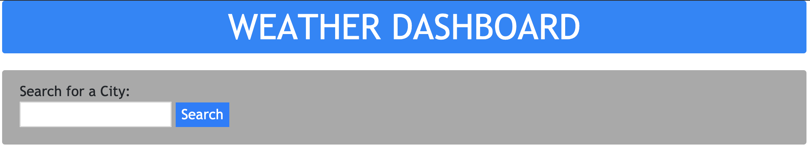
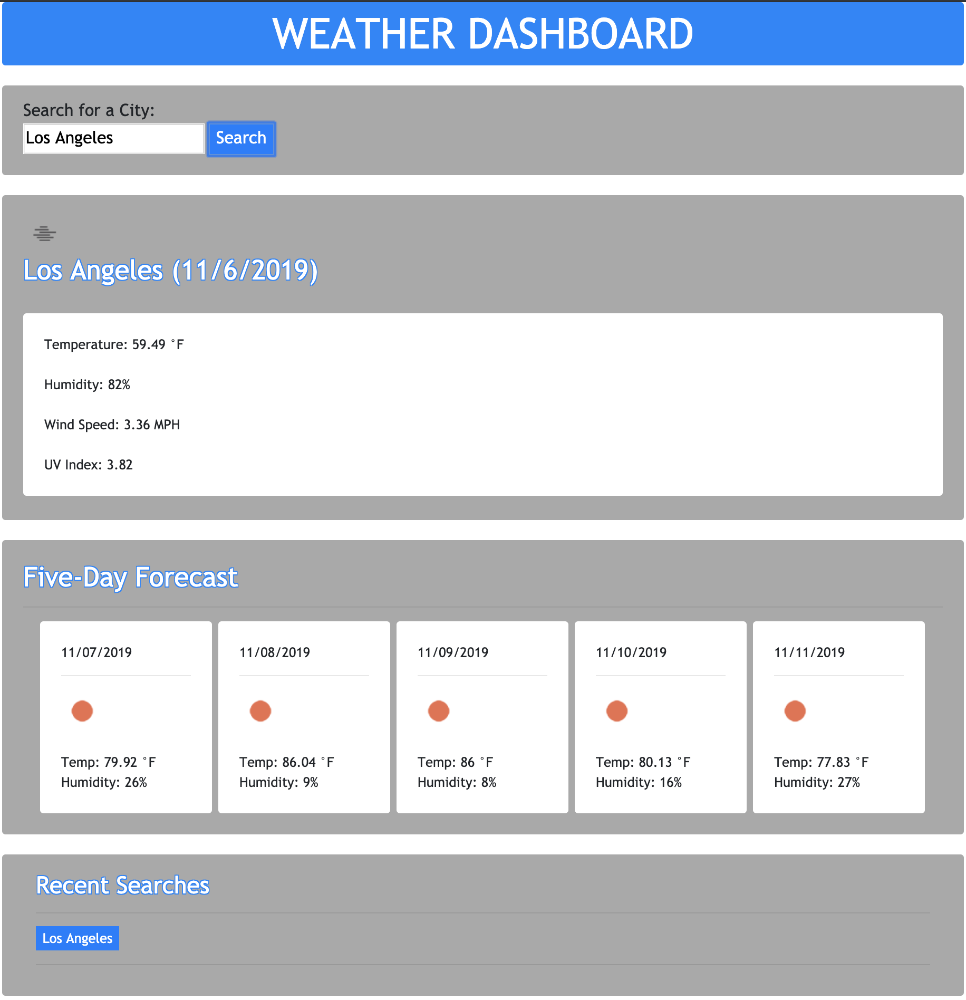

# WeatherDashboard

This application uses OpenWeather API to search for the weather in a given city.  By entering a city name in the search input, the application will return weather data for that city at the given moment, as well as a five-day forecast of weather to come.

The applicaiton works as follows:

    -Launch application.
    -Enter the name of a city in the text input.
    -Press "Submit".
    -The appliaction will return the results for the entered city.

Below are screenshots of the application:

HOME PAGE

SEARCH REUSLTS PAGE

